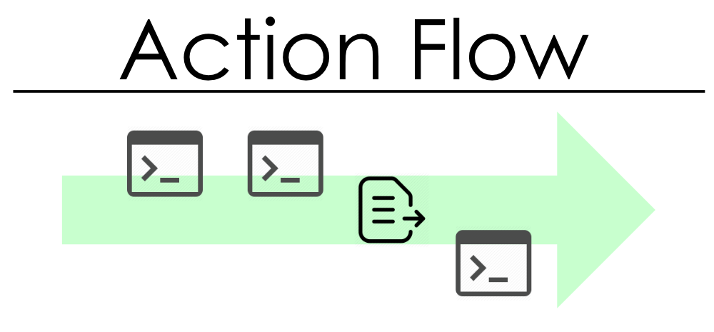

---

# ActionFlow

> process-executor 

> file operation manager

---



---

## Action flow project structure

```xml
<?xml version="1.0" encoding="UTF-8"?>
<project 
	name="test project" 
	description="testings ....">
	
	<action 
		type="wait" 
		name="wait for 100 milliseconds "
		desc="Slow down the process for millions of milliseconds"

		duration_ms="100" 
	 />

	<action
		 type="showdialog"
		 name="notify"
		 desc="notify about result"  
		 message="result"
		 messagetype="info"
	 />

	 < other actions 
	 	.
	 	.
	 	.
	 />
	 
</project>
```

---

## Example running actionflow file

> set **action_flow.exe** as  default app for **.af** files

or run

```bash

action_flow.exe testing_project_file.af

```

## Available actions

- [Wait](#wait)
- [Execute](#execute)
- [Copy folder](#copyfolder)
- [Copy file](#copyfile)
- [Delete files](#deletefiles)
- [Delete folders](#deletefolders)
- [Zip folder](#zipfolder)
- [Show dialog](#showdialog)

---

### wait

```xml
<action
	type="wait" 
	name=""

	desc="Slow down the process for millions of milliseconds"
	duration_ms="" 
/>
```

### execute

```xml
<action
	type="execute" 
	name=""
	desc="Starting the process with the given parameters"

	filename=""
	params="" 
/>		 
```

### copyfolder

```xml
<action 
	type="copyfolder" 
	name=""
	desc="recursively copying a directory with subdirectories and files that complete the copy pattern"

	source=""
	destination="" 
	copy_filepattern="(.)" 
	copy_dirpattern="(.)" 
/>
```
### copyfile

```xml
<action 
	type="copyfile" 
	name=""
	desc="Copy the file"

	source=""
	destination="" 
/>	
```
### deletefiles

```xml
<action 
	type="deletefiles" 
	name=""
	desc="Deleting files from the specified directory that complete the delete pattern"

	source=""
	delete_filepattern="" 
	recursive="true" 
/>	
```
### deletefolders

```xml
<action 
	type="deletefolders" 
	name=""
	desc="Delete folders"

	source=""
	delete_folderpattern="" 
/>		 
```
### zipfolder

```xml
<action
	type="zipfolder" 
	name=""
	desc="Create a zip archive from the selected folder to the specified target file"

	source=""
	zipfile="" 
/>		 
```
### showdialog

```xml
<action 
	type="showdialog" 
	name=""
	desc="Show dialog with message"

	message=""
	messagetype="info" 
/>		
```

---
